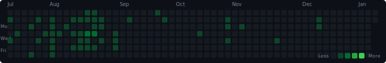

### 👋 Hello! Nice to meet you! 
I'm a **Android Application Developer** using Kotlin and JAVA.

Usually I develop using **Android studio**, also studying development with Swift.

I always enjoy thinking and thinking about new ideas and making them.

#### It's me!

### 🔨 Skills

#### Platforms & Languages
    

#### Tools
    

### 📊 GitHub Stats

  
  

### 🌿 Tistory Contributions

  

